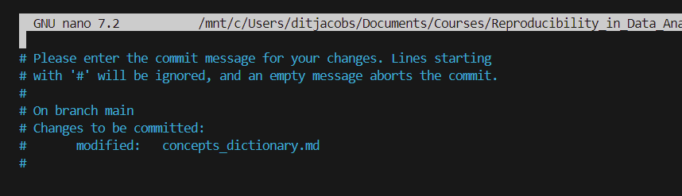
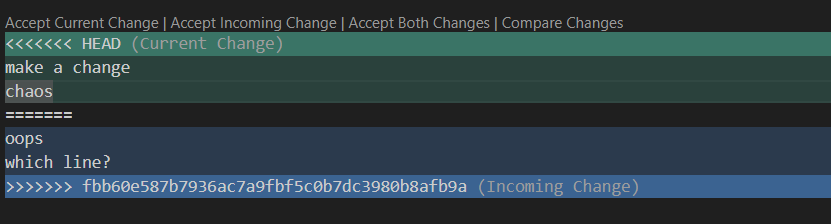
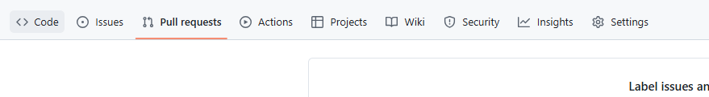

# Git and Github

VIB course: Reproducibility in Data analysis: Git and Github (part 2)

[vibbits/introduction-github: This is a test-repository for the GitHub tutorial.](https://github.com/vibbits/introduction-github)

### Getting ready:

- create a Github account
- Install WSL and GitBash
- Generate SSH key
- Optional: install Marktext
- Optional: Git Kraken
- Optional: Ungit (can be easily installed in VSCode using the extensions)

Instructions can be found on the VIB Github page: [vibbits/introduction-github/tutorials/1_Get_ready_for_the_course](https://github.com/vibbits/introduction-github/tree/master/tutorials/1_Get_ready_for_the_course)

# 1. Introduction

## Git and Github?

**Git** 

⇒ all details can be tracked like a time machine with a time log 

⇒ Git repository = timeline

*Note: Ungit can give extra (visual) information on repository (install in extensions in VSCcode)*

In Git, you need to commit a version of a file, and only when the file is COMMITED, it is kept in a log. 

*Note: Saving is not commiting!* 

Commiting = creating a snap shot of this version 

**Github** 

⇒ backup of your timeline, stores the timelines 

**Git vs. Github:**

- Git (locally) = creating timeline
- Github (remote)= backing up all the timelines

# 2. Getting started

Initialize a git repository in a specific folder, `git init` is only done once!

Create a git repository:

`git init`  

Change the name of the initial branch to “main”:

`git branch -m main`

### Taking a snapshot

Working in 3 different areas from my computer to a local repository 

developing area ⇒ staging area in git ⇒ local repository in git

From developing area to staging area:

`git add filename`

From staging area to local repository:

`git commit -m “meaningful message”` 

the meaningful message should be clear. How was the issue addressed i.e. specify the changes/updates, why was it changed, effects due to change, limitations of the change (if not entirely final version)

Check git configurations:

`git config --global --list`

If no configurations, create configuration:

`git config --global [user.name](http://user.name/) username`

`git config --global user.email email`

*Note: after `git commit`, the repository is not yet visible on github. In order to do so, we need to link local (git) and remote (github) repository to share contents between them.* 

### What would happen if a .git folder is created inside a .git folder

In the .git folder everything is tracked (be careful with this directory!)

No other .git repositories can be in this folder, make sure to check it with for example `ls -la` 

⇒ .git can not be in the folder (or subsfolder) twice, because Git tracks everything in the higher folder and all the subfolders 

Solve problem: Separate the folders or delete empty timelines 

### Where do you work with git?

Git works locally on your computer (*Note: Github is in the cloud*)

**Where do I develop a project?** 
Developing area is the folder where git is initialized, `git init` will initialize a local repository where the timeline is saved (.git)

**Staging area?**

`git add` to staging area ⇒ all files that you want to commit at the same time

Add all files:

`git add *` 

Add a list of files:

`git add file1 file2` 

### Why do we write commit messages?

*Note: always save files and then commit them*

It is not only important, but it is also obligated to add a message! 

You can include a message in the command line. 
Alternatively, a more extensive meaningful msg can be made in the editor. 

How:

`git commit`

⇒ automatically, an error message will pop-up in your default editor (see above) 

Save msg in the editor and close the editor, now the file is committed to the timeline 

*Note: you can change the default editor with following command:*

`git config --global core.editor <editor>`

# 3. A travel in time: Check your versions

### Checking, what is where?

**Check the git status:**

`git status`

- uncommited / to be commited = in the staging area
- untracked = in the developmental area
- unstaged = in the developmental area

Difference untracked & unstaged:

Unstaged = git has a version of file saved in the repository.

Untracked = a completely new file, git sees it exists, but this file has never been added or commited

*Note: use "git restore --staged <file>..." to unstage*

### Why Staging before saving?

A change in one file can interfere with another file, so it makes sense to commit them together. For example when the changes are related.  

In the staging area, you can combine the files that belong together to write one “meaningful msg”. In this manner, repetitive and redundant messages are avoided in the git log. 

Good practice = keep the timeline as clear as possible. 

*Example:* 

A. Commit separately

Commit  for the concepts dictionary:

`git add concepts_dictionary.md` 

`git commit -m “explanation of where the content is and reasoning to use staging area”`

Separate commit for the commands:

`git add commands.md`

`git commit -m “clarifying use of staging area”`

B. Commit together with the same meaningful msg

Commit all = both commands and concepts_dictionary, makes sense to commit together because the changes are related

`git add *`

`git commit -m “explanation of where content is and reasoning to use staging area”`

**How can I travel within the timeline to check for differences in my versions?** 

`git diff commitID1 commitID2`

*NOTE: commit IDs should be chronological! (makes a difference in: added or deleted)* 

`git show commitID1 commitID2` 

*NOTE: drops all content information as well*

**How can I see the history of my timeline?** 

`git log`  = history of all commits 

other options with `git log --help` 

`git log -n  3`= 3 most recent commits 

`git log --abbrev-commit` = each commit has an unique id, but can be abbreviated with this command, this abbrev can be used in other commands for example `git show`

**Why is it useful to have the author’s name and email address in the log?**

author/date/branch/message ⇒ interesting for collaboration 

# 4. Connecting to Github

### Local to remote

The fourth conceptual area is Github. 

Create a new repository in Github

Good practice is to include a README file with general description about the project and instructions

**Connecting local and remote repositories:**

Local repo is created with:

`git init`

**How to link this git repository to github repository**

`git remote add origin ssh-adress`

`git push -u origin main`

*Note: when doing a push for the first time:*`git push -- set-upstream origin main` 

*Note: above commands only create a link between git and github, `git push` to actually push the commited jobs to Github*

# 5. gitignore & README

Add README file and .gitignore to a repo

README.txt ⇒ description for the project and tool usage

.gitignore ⇒ list of files that should not be added to repository (data files/backup files/intermediate files), this is a hidden file

HOW (.gitignore): 

- can list files one by one
- can use templates (github)
- can use expressions, for example, *.csv = ignore all CSV files, !dataset.csv = except this, # make a comment

When file is put into gitignore, and then the status is checked , the ignored file/image status is not given because it is ignored! You can also put .gitignore in the .gitignore file and then it will be ignored, but then you can not commit the .gitignore file 

<aside>
💻

Writing in markdown

*= italic 

**=bold 

***=italic and bold

[link text](https://theactuallink.com)=link (note: for an image put ! before [])

#=heading level 1

##=heading level 2

###=heading level 3

` `= code (note: triple backticks = code block)

</aside>

### How to send everything to github

First make sure you work with a clean working tree (`git status` is clean!) 

Then you have to create a bridge between repositories: local AND remote (done only once!)

- Create a bridge:

`git remote add name ssh`

name = origin 

SSH = address of remote repository (https is mostly used for collaborations)

- send everything that you have COMMITED to the online repository

`git push`

- pull things from github

`git pull`

<aside>
💻

Most relevant “git” commands:

- `git init` (note: only done once!)
- `git add`
- `git commit -m “meaningful message”`
- `git log`
- `git status`
- `git show`/ `git diff`
- `git push`
- `git remote add name ssh`(note: only done once!)
- `git pull`
</aside>

### Recover work

The last commit is unwanted ⇒ check timeline: `git log`

`git revert commitID`

*Note: git erase can not be reversed, but git revert can!*

Revert = erase a commit job and keeps history 

# 6. Collaborating in Github

### Recovering a copy & collaborating

Imagine you lose your local repository, but you have the same repository remotely on Github.

Restore the local repository by cloning this repository on Github: 

`git clone ssh`

ssh from the particular repository

This will download all repository content + .git (git init) + creates a bridge (git remote add)

**The difference between git clone and git pull** 

`git pull`= only when you want to get updated version of a repo

`git clone` = when you want to download a tool/restore repo 

### Collaborating on Github

**How to add someone as a collaborator in GitHub**

Go to the repo on GitHub and add a collaborator in the settings > collaborators > select a collaborator

*Note: ssh key is different from ssh address (only for specific repository)*

In the next step the collaborator can clone the repo locally to make changes. 

Clone the repository for collaboration:

`git clone ssh`

when making changes:

`git add | git commit | git push`

Collaborator will receive changes when doing:

`git pull`

*Note: when collaborating, make sure that you always synchronize first with* `git pull` *and* `git push` *once you made the required changes*

### Solving conflicts

When collaborating, branches are often used (see later). In this way, the same file is added in parallel branches and edits/changes can later be merged. However, this will give conflicts!

When you and the collaborator were working on the same file/the same line. The person who pushed last will get a conflict! They have to pull the content that the other person has pushed to Github. Then manually, they can decide what changes should be kept. When all decisions are made, add, commit, and push these new changes.

Example of a conflict below:

*Note: In a timeline, the most recent commit is called HEAD*

HEAD has my text that hasn’t been pushed yet, and below blue has been pushed and pulled.

### Tagging

Tag = giving a name to a commit 

Why?

Finding a commit easily in git log

Create a tag: 

`git tag name`

Get list of all the tags:

`git tag`

Pushing the tags to Github (*note: if you don’t do this, the tags are not visible in Github*): 

`git push --tags`

Tag a commit job in the past based on the name:

`git tag name commitID`

Delete tag:

`git tag -d name`

# 7. Branches

## Experimenting Risk Free

### How to create a branch

Instead of working in a unique linear time-line, we can create parallel time-lines with branches. Branches are copies of the project. 

⇒ can be done in any point in time with a specific name:

`git branch name`

Each timeline (branches) has their own history. The history before the branch point is shared, but after branch point they are completely independent. They can also be connected again by merging 

**Why would you use branches?** 

- Experimenting risk free ⇒ instead of messing with the main one, make a branch and do tests
- Collaboration in a project ⇒ work in the individual branch and then merge ⇒ cause conflict, but then you can decide on what to keep in the files
- Looking for different solutions on the same issue ⇒ working on the same time on the same issue
- Release versions

When a branch is created, there are several heads for each branch 

*Note: when you give the branch a name, it is interesting to add your initials so it is clear that you are working on it*

### Move between branches

You can move between branches with `git checkout` ⇒ when you then commit and push, this is only done for the branch you are in 

Move through branches: 

`git checkout branchname`

Good practice!

- close all the files
- go to the new branch with `git checkout`
- make a change
- add and commit changes
- optional: check ungit
- Push it to github

list of all the existing branches and names

`git branch -l`

list of branches including the ones that exist remotely

`git branch -a`

to check where (on which branch) you are

`git status`

*Note: if you make changes in a branch and then move to another branch, git will not have the changes stored in the other branch. ONLY everything that exists in the particular branch (the one you are in) will be visible!*

However, if some files are not closed, this can be confusing. You might think that you are in another branch, while it doesn’t exist in this particular branch. Good practice: always close all files. 

! `git push` is done separately for each branch, when you do `git pull` everything that is remotely available will be pulled, meaning all the branches that were pushed to Github!

*Note: Make sure that when you create branch, that you know where you are in the tree, and know from what point you want to create a branch!*

**Where can I create a branches?** 

Only in projects I own or collaborate in

**How many branches can I have in one repository?** 

There is no defined number, but as many as you and the collaborators can manage

## Solving conflicts and changing old versions

### Traveling in the timeline

You can move to the past

Move to an old commit:

`git checkout commitID`

When you add a new line in this old commit file and you try to commit the change, you start working in a detached head.

You can go back by switching to main OR create a new branch to the detached head ( `git switch -c new_branch_name`)

To attach the detached head:

`git switch -c branchname` 

## Merging

At some point, you might want to merge branches. 

**When merging?**

- Experiment worked out
- Finished collaboration
- Problem solved

Merging a branch:

`git merge branchname`

! Conflicts will pop-up when merging ⇒ solve again by making a decision and then add, commit, and push!

! when you merge make sure you don’t delete any files that you want to keep, the direction of merging might be important, so you don’t overwrite existing files

You can delete a whole branch:

`git branch -d branchname`

With this command, you delete the branch and also lose all the history of the commits

### Alternative for collaborating

In case you don’t want to clone all versions locally, you can do it remotely ⇒ go to Github. 

In Github, you can open devgit or codespace github by pressing “.”

(alternatively, you can click on “code” in a repo and then code space in github)

`ctrl+shift+V` in a particular file will give the view of the markdown file in Github

When you use “commit & push” option in source control, the files are immediately commited! 

If you use + in “source control”, then you can put files together in staging area 

You can make branches in the code space:

Through pull request, you can merge two branches. This needs to be reviewed and accepted.  

Here (create pull request), you can give instructions on what changes should be made. However, someone needs to review and approve it

You can see the request in pull requests in the repository. At this location, the owner of the repo can review the suggested changes before implementing.

You can choose people to assign a task + label (bug, documentation, create on yourself) on the right-hand side of the pull request. 

**Report issues in Github in the repository**

You can also assign this issue to someone.

You can even go into the code/md files in the repository and add an issue to the exact line (the number) in the code

Example:

Close issue when it is solved

*Note: you can create a project ⇒ can change status in the issues, classification and planning how to handle issues* 

# 8. Forks

### Forking

Create an independent copy of a repository 

**What is the difference between clone, branch fork**

Clone ⇒ copy of remote repository to local (computer) 

Branch ⇒ create parallel timeline in a repository that exists in both local and remote timeline (if commited and pushed)

Fork ⇒ take specific remote repo, and create independent copy in another remote repo ⇒ in this way that person with the copy is owner. It is completely independent. The forked repo can be cloned to your local computer. In the fork, you can not pull from the original repo. There is a remaining link between the repo and forked repo. ONLY “merge” when original owner decides = interesting for a controlled collaboration. 

In a collaboration, you need a pull request when you want to integrate changes from original and forked repo ⇒ the pull request needs to be accepted by the owner of the original repo.

**How to create a fork**

**How to make changes to the original repo when using a fork**

Make a change somewhere and commit the change

*Note: Merging is done with a pull request!*

Open a pull request under “contribute”. The owner can then review the request. 

Owner needs to go to the “pull requests” in the repo, and accept the request

*Note: You can also fork from a specific branch instead of the main.*
