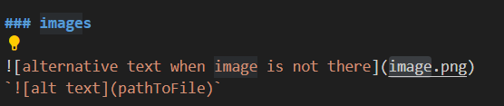

# Markdown cheat sheet

## General markdown information

# Header 1
`use # HEADER`
## Header 2
`use ## HEADER`
### Header 3 
`use ### HEADER`

`code` use `` to highlight code.

**Bold text** (place text in between `** TEXT **`)

**Italic text** (place text in between `* TEXT *` or `_ TEXT _`)

## lists

### ordered lists
1. first list item
2. second list item
3. third list item

### Unordered lists
- A list item
- Another list item
- yet another list item

## links, documents and images
### links

[visible url](https://google.com)
`[text](url)`

### documents

``

### images

``